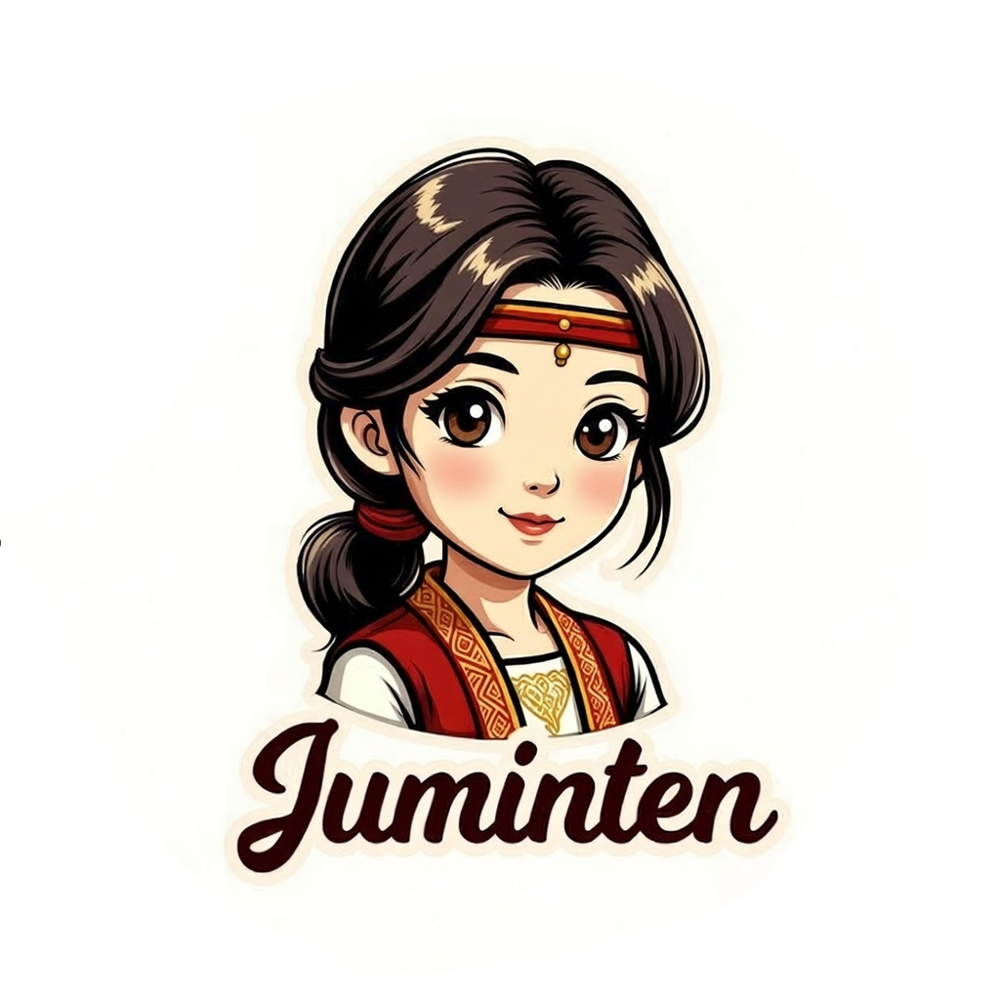

<div id="top"></div>
<!-- PROJECT LOGO -->
<br />
<div align="center">
  
  <p align="center">
    <a href="#">View Demo</a>
    ·
    <a href="https://github.com/theycantrevealus/horas/issues">Report Bug</a>
    ·
    <a href="https://github.com/theycantrevealus/horas/issues">Request Feature</a>
  </p>
</div>

<!-- TABLE OF CONTENTS -->
<details>
  <summary>Table of Contents</summary>
  <ol>
    <li>
      <a href="#about-the-project">About The Project</a>
      <ul>
        <li><a href="#built-with">Built With</a></li>
      </ul>
    </li>
    <li>
      <a href="#getting-started">Getting Started</a>
      <ul>
        <li><a href="#prerequisites">Prerequisites</a></li>
        <li><a href="#installation">Installation</a></li>
      </ul>
    </li>
    <li><a href="#usage">Usage</a></li>
    <li><a href="#roadmap">Roadmap</a></li>
    <li><a href="#contributing">Contributing</a></li>
    <li><a href="#license">License</a></li>
    <li><a href="#contact">Contact</a></li>
    <li><a href="#acknowledgments">Acknowledgments</a></li>
    <li><a href="#contributors">Contributors</a></li>
  </ol>
</details>

<!-- ABOUT THE PROJECT -->

## About The Project

Just a revamp project for loyalty system with proper management and architecture

<p align="right">(<a href="#top">back to top</a>)</p>

### Built With

Built using these awesome frameworks

- [Nest.js](https://nestjs.com/)

<p align="right">(<a href="#top">back to top</a>)</p>

<!-- GETTING STARTED -->

## Getting Started

### Configuration

You need to make folder `environment`. Define the child folder name with `NODE_ENV` value

```shell
environment
    - development
    - production
```

Configuration files must exists are:

1. couchbase.env

<!-- PREREQUISITES -->

### Requirements

1. Nodejs
2. npm@9.5.1
   1. @nestjs/cli@9.2.0
   2. jest@29.4.3

<p align="right">(<a href="#top">back to top</a>)</p>

<!-- Installation -->

### Instalation

```shell
npm i
```
