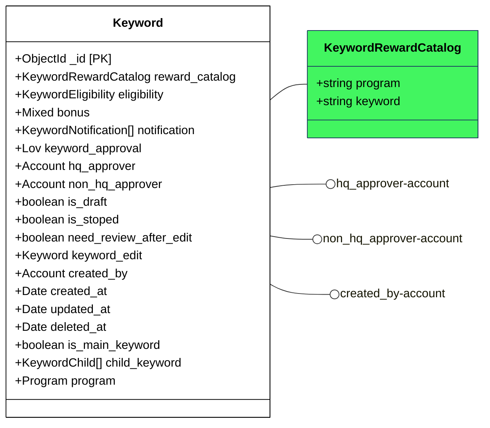
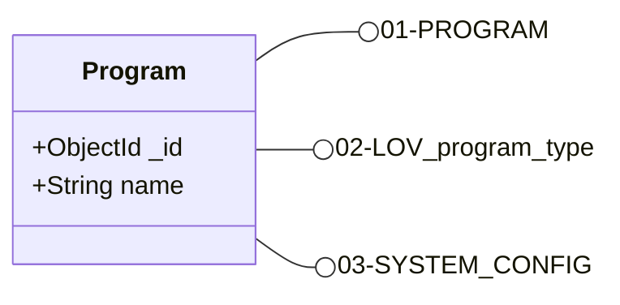
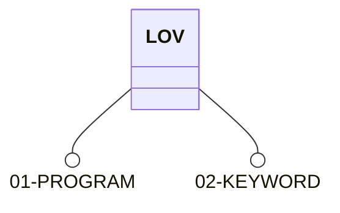

Rifqi

```mermaid
classDiagram
    direction LR

    class Keyword:::collection {
        +ObjectId _id [PK]
        +KeywordRewardCatalog reward_catalog
        +KeywordEligibility eligibility
        +Mixed bonus
        +KeywordNotification[] notification
        +Lov keyword_approval
        +Account hq_approver
        +Account non_hq_approver
        +boolean is_draft
        +boolean is_stoped
        +boolean need_review_after_edit
        +Keyword keyword_edit
        +Account created_by
        +Date created_at
        +Date updated_at
        +Date deleted_at
        +boolean is_main_keyword
        +KeywordChild[] child_keyword
        +Program program
    }

    class KeywordRewardCatalog:::subdocument {
        +string program
        +string keyword
    }

    classDef collection fill:#fff,stroke:#000,color:#000;
    classDef subdocument fill:#42f560,stroke:#1d3d60,color:#000;
    classDef takeout fill:#42f560,stroke:#1d3d60,color:#000;

    Keyword -- KeywordRewardCatalog
    Keyword --() hq_approver-account
    Keyword --() non_hq_approver-account
    Keyword --() created_by-account
```

Erman

```mermaid
classDiagram
    direction LR

    class Program:::dto {
        +ObjectId _id
        +String name
    }

    Program --() 01-PROGRAM
    Program --() 02-LOV_program_type
    Program --() 03-SYSTEM_CONFIG
```

ABC

```mermaid
classDiagram
    class LOV {}

    LOV --() 01-PROGRAM
    LOV --() 02-KEYWORD
```
