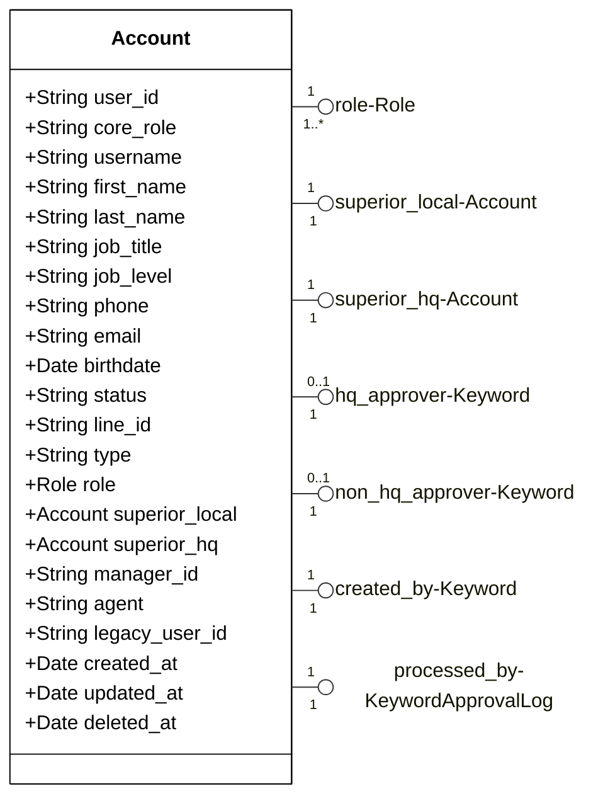

# Account Class

```mermaid
---
config:
  layout: elk
---
%%{ init: { 'flowchart': { 'curve': 'stepBefore' }, 'themeVariables': { 'curve': 'basis' } } }%%
classDiagram
  direction LR

  class Account:::collection {
    +String user_id
    +String core_role
    +String username
    +String first_name
    +String last_name
    +String job_title
    +String job_level
    +String phone
    +String email
    +Date birthdate
    +String status
    +String line_id
    +String type
    +Role role
    +Account superior_local
    +Account superior_hq
    +String manager_id
    +String agent
    +String legacy_user_id

    +Date created_at
    +Date updated_at
    +Date deleted_at
  }

  Account "1..*" --() "1" role-Role
  Account "1" --() "1" superior_local-Account
  Account "1" --() "1" superior_hq-Account

  %% Keyword
  Account "1" --() "0..1" hq_approver-Keyword
  Account "1" --() "0..1" non_hq_approver-Keyword
  Account "1" --() "1" created_by-Keyword
  Account "1" --() "1" processed_by-KeywordApprovalLog

  classDef collection fill:#fff,stroke:#000,color:#000;
  classDef subdocument fill:#00a666,stroke:#1d3d60,color:#fff;
  classDef takeout fill:#941919,stroke:#1d3d60,color:#fff;
  classDef untrack fill:#947b19,stroke:#1d3d60,color:#fff;
```
