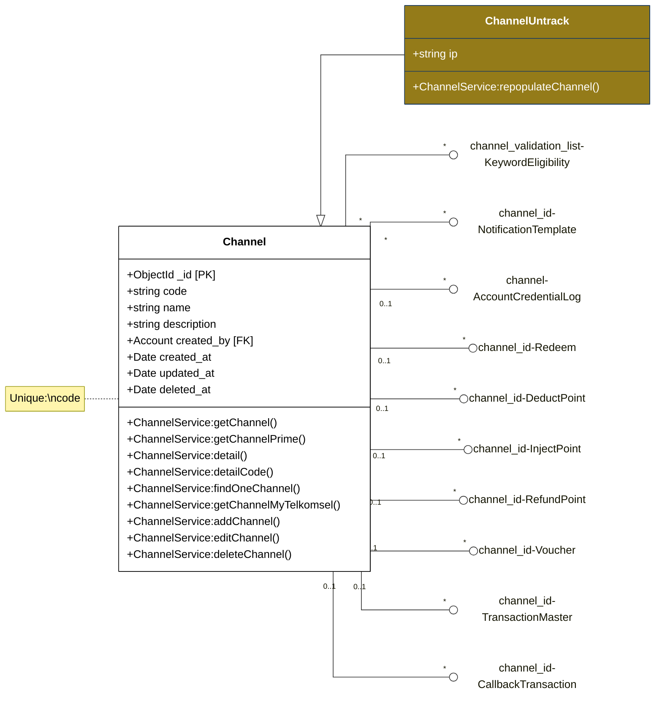

# Channel Class

```mermaid
%%{ init: { 'flowchart': { 'curve': 'stepBefore' } } }%%
classDiagram
direction LR

    note for Channel "Unique:\ncode"

    class Channel:::collection {
        +ObjectId _id [PK]
        +string code
        +string name
        +string description
        +Account created_by [FK]
        +Date created_at
        +Date updated_at
        +Date deleted_at

        +ChannelService:getChannel()
        +ChannelService:getChannelPrime()
        +ChannelService:detail()
        +ChannelService:detailCode()
        +ChannelService:findOneChannel()
        +ChannelService:getChannelMyTelkomsel()
        +ChannelService:addChannel()
        +ChannelService:editChannel()
        +ChannelService:deleteChannel()
    }

    class ChannelUntrack:::untrack {
        +string ip
        +ChannelService:repopulateChannel()
    }

    Channel <|-- ChannelUntrack

    Channel "*" --() "*" channel_validation_list-KeywordEligibility
    Channel "*" --() "*" channel_id-NotificationTemplate
    Channel "0..1" --() "*" channel-AccountCredentialLog
    Channel "0..1" --() "*" channel_id-Redeem
    Channel "0..1" --() "*" channel_id-DeductPoint
    Channel "0..1" --() "*" channel_id-InjectPoint
    Channel "0..1" --() "*" channel_id-RefundPoint
    Channel "0..1" --() "*" channel_id-Voucher
    Channel "0..1" --() "*" channel_id-TransactionMaster
    Channel "0..1" --() "*" channel_id-CallbackTransaction

    %% === design ===
    classDef collection fill:#fff,stroke:#000,color:#000;
    classDef subdocument fill:#00a666,stroke:#1d3d60,color:#fff;
    classDef takeout fill:#941919,stroke:#1d3d60,color:#fff;
    classDef untrack fill:#947b19,stroke:#1d3d60,color:#fff;
```
