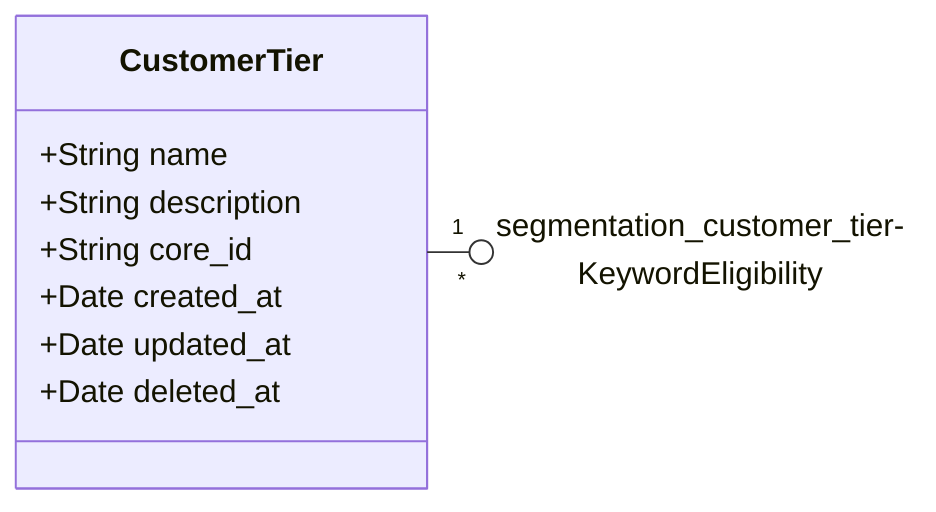

# Customer Tier Class

```mermaid
---
config:
  layout: elk
---
%%{ init: { 'flowchart': { 'curve': 'stepBefore' }, 'themeVariables': { 'curve': 'basis' } } }%%
classDiagram
  direction LR

  class CustomerTier {
    +String name
    +String description
    +String core_id
    +Date created_at
    +Date updated_at
    +Date deleted_at

  }

  CustomerTier "*" --() "1" segmentation_customer_tier-KeywordEligibility


  classDef collection fill:#fff,stroke:#000,color:#000;
  classDef subdocument fill:#00a666,stroke:#1d3d60,color:#fff;
  classDef takeout fill:#941919,stroke:#1d3d60,color:#fff;
  classDef untrack fill:#947b19,stroke:#1d3d60,color:#fff;
```
