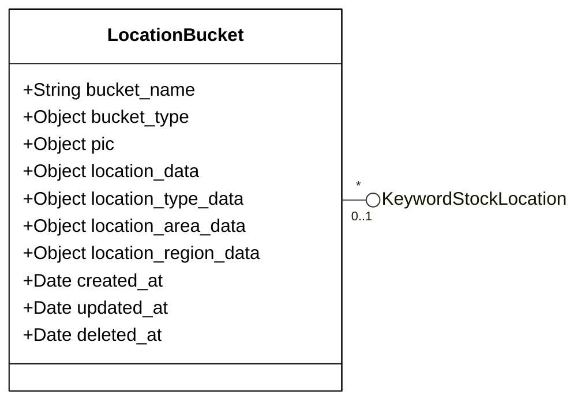

# Location Bucket Class

```mermaid
---
config:
  layout: elk
---
%%{ init: { 'flowchart': { 'curve': 'stepBefore' }, 'themeVariables': { 'curve': 'basis' } } }%%
classDiagram
  direction LR

  class LocationBucket:::collection {
    +String bucket_name
    +Object bucket_type
    +Object pic
    +Object location_data
    +Object location_type_data
    +Object location_area_data
    +Object location_region_data
    +Date created_at
    +Date updated_at
    +Date deleted_at
  }

  LocationBucket "0..1" --() "*" KeywordStockLocation


  classDef collection fill:#fff,stroke:#000,color:#000;
  classDef subdocument fill:#00a666,stroke:#1d3d60,color:#fff;
  classDef takeout fill:#941919,stroke:#1d3d60,color:#fff;
  classDef untrack fill:#947b19,stroke:#1d3d60,color:#fff;
```
