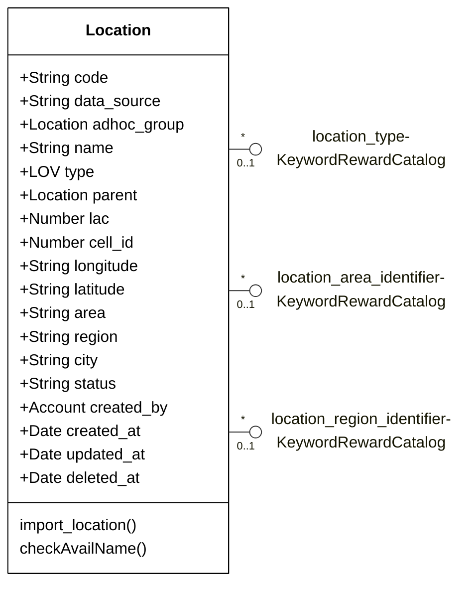

# Location Class

```mermaid
---
config:
  layout: elk
---
%%{ init: { 'flowchart': { 'curve': 'stepBefore' }, 'themeVariables': { 'curve': 'basis' } } }%%
classDiagram
  direction LR

  class Location:::collection {
    +String code
    +String data_source
    +Location adhoc_group
    +String name
    +LOV type
    +Location parent
    +Number lac
    +Number cell_id
    +String longitude
    +String latitude
    +String area
    +String region
    +String city
    +String status

    +Account created_by
    +Date created_at
    +Date updated_at
    +Date deleted_at

    import_location()
    checkAvailName()
  }

  %% Keyword
  Location "0..1" --() "*" location_type-KeywordRewardCatalog
  Location "0..1" --() "*" location_area_identifier-KeywordRewardCatalog
  Location "0..1" --() "*" location_region_identifier-KeywordRewardCatalog

  %% Program


  classDef collection fill:#fff,stroke:#000,color:#000,rx:15px,ry:15px;
  classDef subdocument fill:#00a666,stroke:#1d3d60,color:#fff;
  classDef takeout fill:#941919,stroke:#1d3d60,color:#fff;
  classDef untrack fill:#947b19,stroke:#1d3d60,color:#fff;
```
