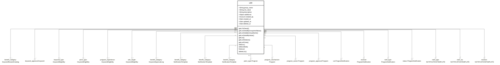

# LOV Class

```mermaid
%%{ init: { 'flowchart': { 'defaultRenderer': 'elk', 'curve': 'stepAfter' }, 'config': { 'layout': 'elk', 'elk': { 'mergeEdges': false } } } }%%
classDiagram

  class LOV:::collection {
    +String group_name
    +String set_value
    +String description
    +Object additional

    +Account created_by
    +Date created_at
    +Date updated_at
    +Date deleted_at

    getLOVDetail()
    getLovDetailByGroupAndValue()
    getLovDataByGroupName()
    getLovDetailByValue()
    getLov()
    getLovRelation()
    getLovPrime()
    addLov()
    addLovBulk()
    findLov()
    deleteLov()
  }


  %% Keyword
  LOV "0..1" --() "*" benefit_category-KeywordRewardCatalog
  LOV "0..1" --() "*" keyword_approval-Keyword
  LOV "0..1" --() "*" keyword_type-KeywordEligibility
  LOV "0..1" --() "*" point_type-KeywordEligibility
  LOV "0..1" --() "*" program_experience-KeywordEligibility
  LOV "0..1" --() "*" adn_target-KeywordEligibility
  LOV "0..1" --() "*" benefit_category-KeywordApprovalLog
  LOV "0..1" --() "*" benefit_category-NotificationTemplate
  LOV "1" --() "*" benefit_category-NotificationTemplate
  LOV "1" --() "*" benefit_category-NotificationTemplate

  %% Program
  LOV "0..1" --() "*" point_type-Program
  LOV "0..1" --() "*" program_mechanism-Program
  LOV "0..1" --() "*" program_owner-Program
  LOV "0..1" --() "*" program_approval-Program

  LOV "0..1" --() "*" via-ProgramNotification
  LOV "0..1" --() "*" receiver-ProgramNotification
  LOV "0..1" --() "*" notif_type-ProgramNotification
  LOV "0..1" --() "*" status-ProgramNotification

  LOV "0..1" --() "*" notif_type-NOTIFICATIONTEMPLATE
  LOV "0..1" --() "*" notif_via-NOTIFICATIONTEMPLATE
  LOV "0..1" --() "*" receiver-NOTIFICATIONTEMPLATE


  classDef collection fill:#fff,stroke:#000,color:#000,rx:100px,ry:100px;
  classDef subdocument fill:#00a666,stroke:#1d3d60,color:#fff;
  classDef takeout fill:#941919,stroke:#1d3d60,color:#fff;
  classDef untrack fill:#947b19,stroke:#1d3d60,color:#fff;
```
