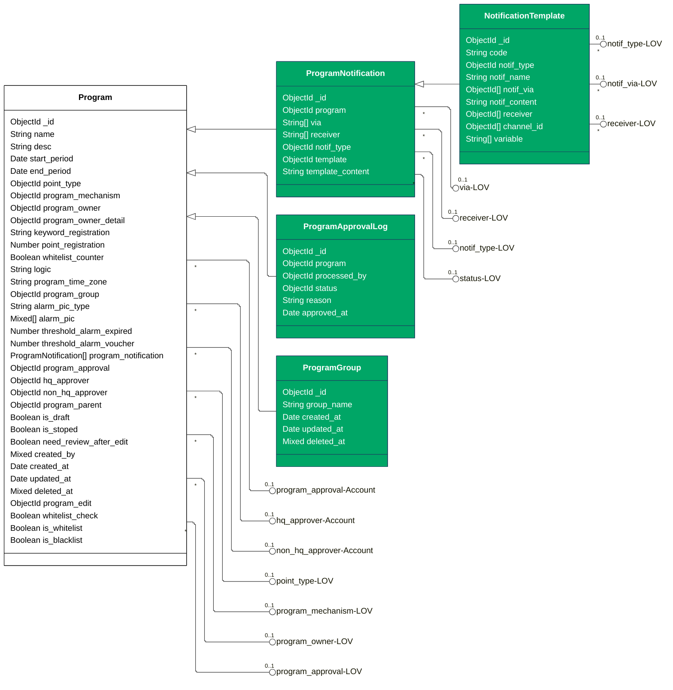

# Program Schema

```mermaid
---
config:
  layout: elk
---
%%{ init: { 'flowchart': { 'curve': 'stepBefore' } } }%%
classDiagram
    direction LR

    class Program {
        ObjectId _id
        String name
        String desc
        Date start_period
        Date end_period
        ObjectId point_type
        ObjectId program_mechanism
        ObjectId program_owner
        ObjectId program_owner_detail
        String keyword_registration
        Number point_registration
        Boolean whitelist_counter
        String logic
        String program_time_zone
        ObjectId program_group
        String alarm_pic_type
        Mixed[] alarm_pic
        Number threshold_alarm_expired
        Number threshold_alarm_voucher
        ProgramNotification[] program_notification
        ObjectId program_approval
        ObjectId hq_approver
        ObjectId non_hq_approver
        ObjectId program_parent
        Boolean is_draft
        Boolean is_stoped
        Boolean need_review_after_edit
        Mixed created_by
        Date created_at
        Date updated_at
        Mixed deleted_at
        ObjectId program_edit
        Boolean whitelist_check
        Boolean is_whitelist
        Boolean is_blacklist
    }

    class ProgramNotification:::subdocument {
        ObjectId _id
        ObjectId program
        String[] via
        String[] receiver
        ObjectId notif_type
        ObjectId template
        String template_content
    }

    class ProgramApprovalLog:::subdocument {
        ObjectId _id
        ObjectId program
        ObjectId processed_by
        ObjectId status
        String reason
        Date approved_at
    }

    class ProgramGroup:::subdocument {
        ObjectId _id
        String group_name
        Date created_at
        Date updated_at
        Mixed deleted_at
    }

    class NotificationTemplate:::subdocument {
        ObjectId _id
        String code
        ObjectId notif_type
        String notif_name
        ObjectId[] notif_via
        String notif_content
        ObjectId[] receiver
        ObjectId[] channel_id
        String[] variable
    }

    Program <|-- ProgramNotification
    Program <|-- ProgramApprovalLog
    Program <|-- ProgramGroup
    ProgramNotification <|-- NotificationTemplate

    Program "*" --() "0..1" program_approval-Account
    Program "*" --() "0..1" hq_approver-Account
    Program "*" --() "0..1" non_hq_approver-Account

    Program "*" --() "0..1" point_type-LOV
    Program "*" --() "0..1" program_mechanism-LOV
    Program "*" --() "0..1" program_owner-LOV
    Program "*" --() "0..1" program_approval-LOV

    ProgramNotification "*" --() "0..1" via-LOV
    ProgramNotification "*" --() "0..1" receiver-LOV
    ProgramNotification "*" --() "0..1" notif_type-LOV
    ProgramNotification "*" --() "0..1" status-LOV

    NotificationTemplate "*" --() "0..1" notif_type-LOV
    NotificationTemplate "*" --() "0..1" notif_via-LOV
    NotificationTemplate "*" --() "0..1" receiver-LOV

    classDef default fill:#fff,stroke:#000,color:#000;
    classDef subdocument fill:#00a666,stroke:#1d3d60,color:#fff;
    classDef takeout fill:#941919,stroke:#1d3d60,color:#fff;
    classDef untrack fill:#947b19,stroke:#1d3d60,color:#fff;
```
